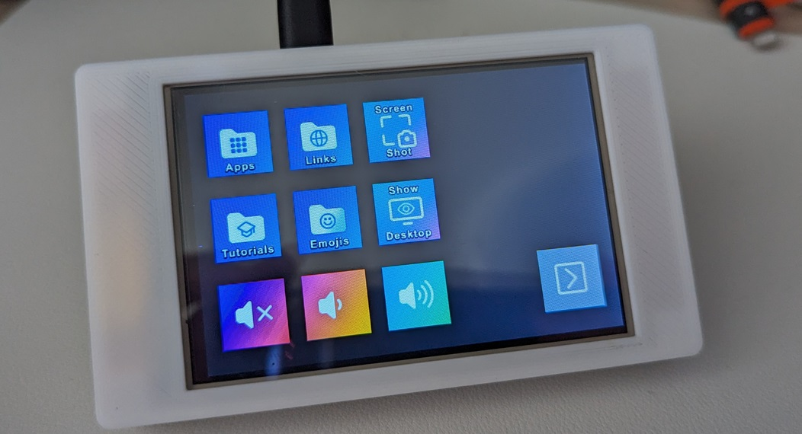
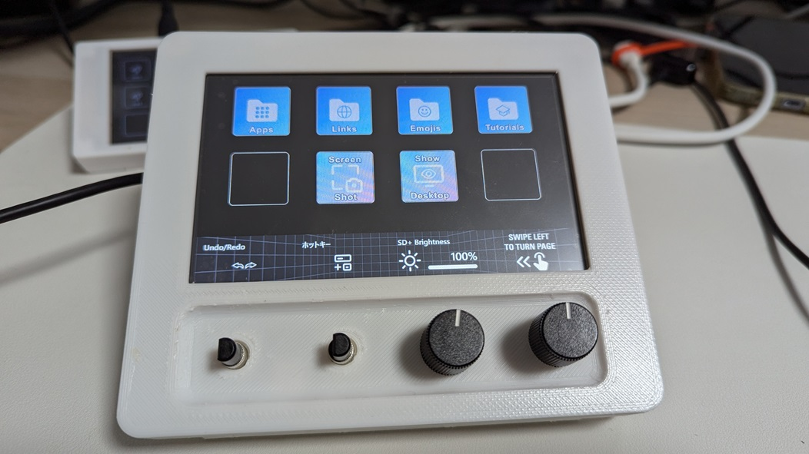
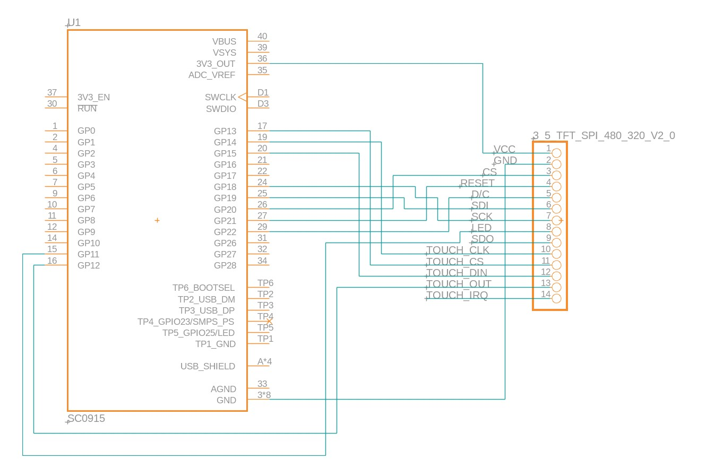
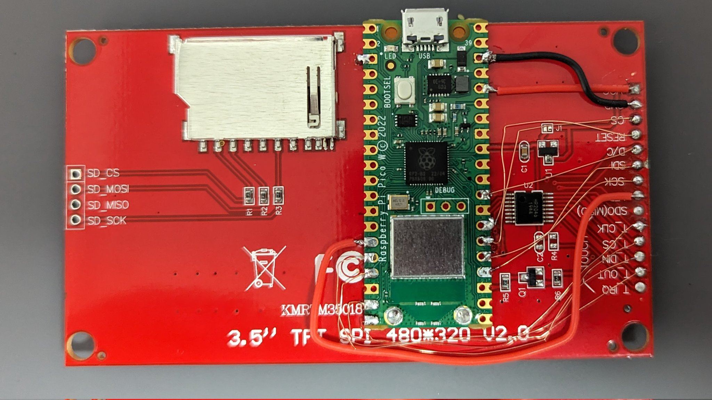
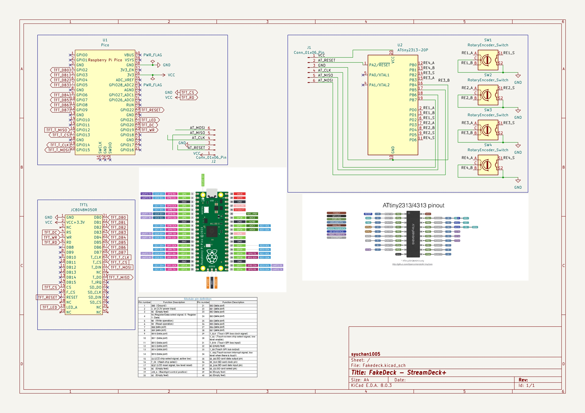
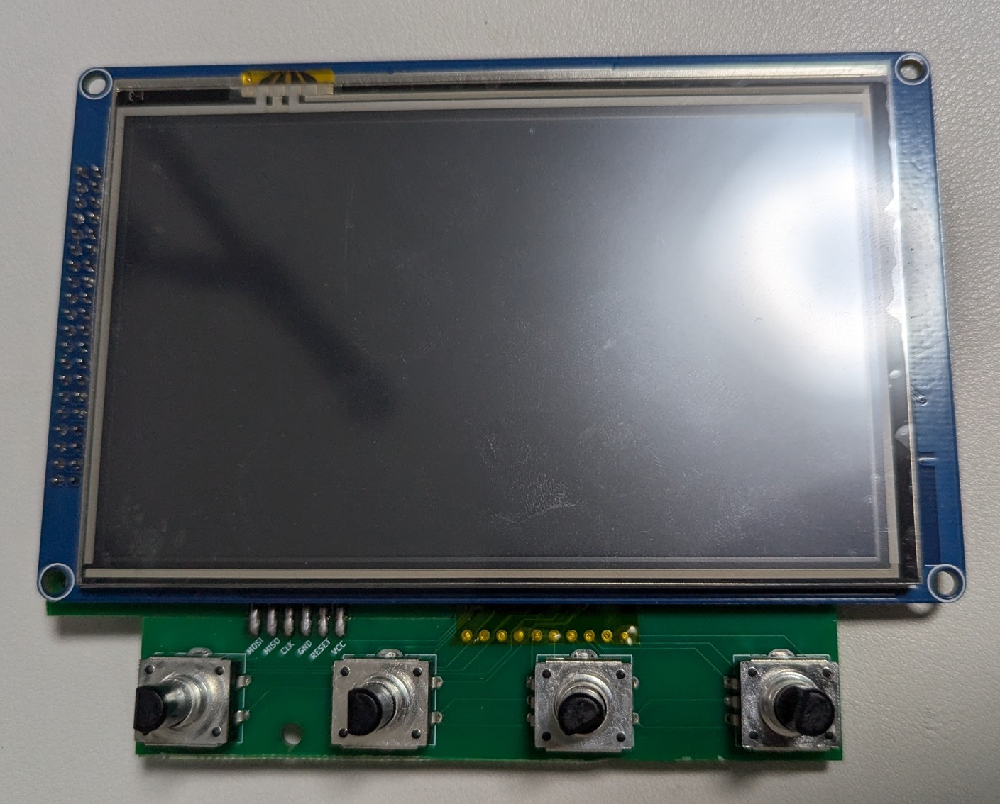
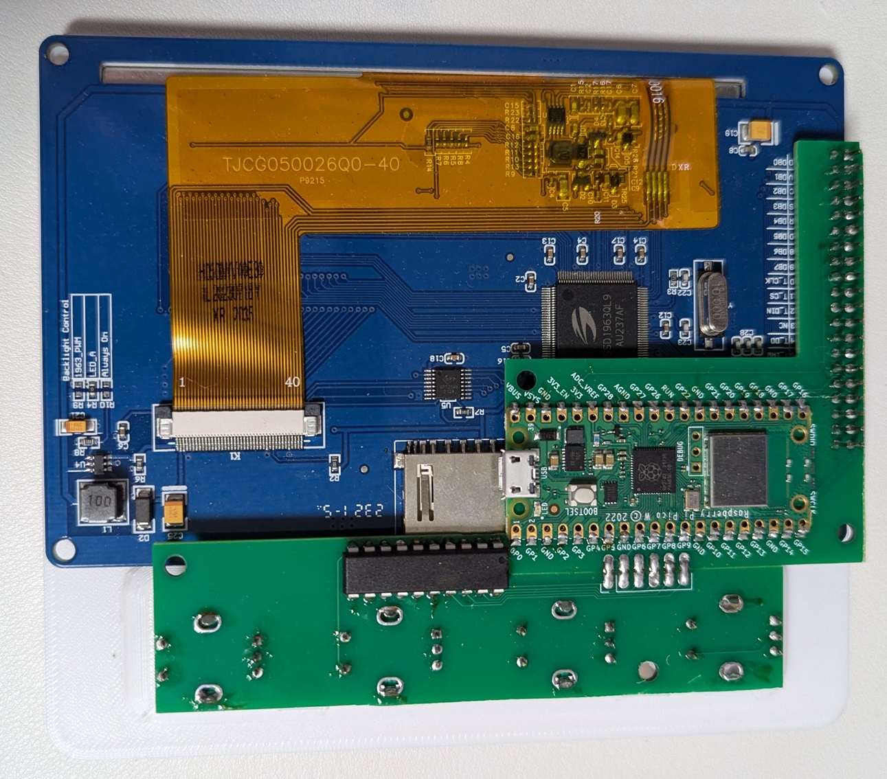

# Fakedeck
Using raspberry pi pico as a stream deck

## Avaiable devices

|Mk2|Plus|
|:--:|:--:|
|||

## How to create : StreamDeck Mk.2
### Parts
- Raspberry Pi Pico
- ILI9488 TFT with Touch: [AliExpress](https://www.aliexpress.com/item/32985467436.html)
> [!IMPORTANT]
> Make sure to select "touch screen"
- Solder, wire, etc.
- 3D printers for creating a case - [Top](./assets/Mk2/Case%20-%20Top.stl), [Bottom](./assets/Mk2/Case%20-%20Bottom.stl)
- M3 x 6mm screw *4

### Wire

> [!NOTE]
> LCD uses 90 mA. 
> In the example, the back of the LCD is shaved and soldered to hold the pico in place.

### Build
1. Setup [PlatformIO IDE](https://platformio.org/platformio-ide)
2. Clone and open this project
3. Change environment to `pico_deckMk2`
4. Build .uf2 file!

## How to create : StreamDeck+
### Parts
- Raspberry Pi Pico W
- ATtiny2313
- SSD1963 TFT with Touch: [AliExpress](https://www.aliexpress.com/item/1005006305412643.html)
> [!IMPORTANT]
> Make sure to select "resistive touch"
- Rotary encoder with switch (PEC12R-4220F-S0024) * 4: [Digikey](https://www.digikey.jp/short/jrrh2j7r), [Monotaro](https://www.monotaro.com/p/3483/7593/)
- Stripboard(approx. 120 x 90 (mm)) or Order PCB
- 3D printers for creating a case - [Top](./assets/Plus/Case%20-%20Top.stl), [Bottom body](./assets/Plus/Case%20-%20Bottom%20body.stl), [Bottom base](./assets/Plus/Case%20-%20Bottom%20base.stl), [Bottom bridge](./assets/Plus/Case%20-%20Bottom%20bridge.stl)
- M3 x 6mm screw *4

### Wire

|Front|Back|
|:--:|:--:|
|||

> [!CAUTION]
> The SDCard slot on the screen interferes with the ATtiny2313 leads.
> Cut the ATtiny2313 leads to a length that does not protrude from the PCB, solder the surface and protect it with electrical tape or remove the SDCard slot.

### projects

#### pico_avrisp_wifi
Write to avr microcontroller (attiny2313) using Raspberry Pi Pico W via WiFi

This project access WiFi AP. You should copy `config.sample.ini` to `config.ini`, and change values to your Wifi settings.

> [!NOTE]
> In my enviroment, [avrdude](https://github.com/avrdudes/avrdude) can not communicate with Raspberry Pi Pico via usb serial. So, It write to avr microcontroller via WiFi.

> [!IMPORTANT]
> In my environment, avrdude 6.3(PlatformIO embedded version) can not write via WiFi. Please update to **^7.3**. (You can replace files in `tool-avrdude` package)

#### avr
Get the four rotary encoder with push switch values via SPI.

### Build
#### Custom PCB
This project includes the [kicad project](./assets/Plus/kicad) and the gerber filse. These can be used to order PCBs. (I used JLCPCB).

The included Gerber files are of a size that can be ordered from the JLCPCB for $2. If you are not interested in it, we recommend generating your own Gerber files.

#### Hardware
Solder the rotary encoders with reference to the [kicad project](./assets/Plus/kicad), making sure that the Screen display area is correct before soldering the rotary encoders.

#### Software
1. Setup [PlatformIO IDE](https://platformio.org/platformio-ide)
2. Clone and open this project
3. Copy `config.sample.ini` to `config.ini` and edit it
4. Change environment to `pico_avrisp_wifi`
5. Build .uf2 file and Upload it
6. Change environment to `attiny2313`, build and upload.
7. Change environment to `pico_deckPlus`, build and upload.

## Tips
- [HID Explorer](https://nondebug.github.io/webhid-explorer/) is an easy HID testing tool using WebHID
- Reboot device and enter bootsel mode: Send `[02, FF]` to the output report
- Reboot device: Send `[02, FE]` to the output report

## Reference
- [ESP8266AVRISP](https://github.com/esp8266/Arduino/tree/19b7a29720a6f2c95d06e2ea4baa335dcf32e68f/libraries/ESP8266AVRISP)
- [avr-usi-spi](https://github.com/tessel/avr-usi-spi/blob/77ce496d6bc404684158e619695c2fb7bc76815a/spi_via_usi_driver.c)
