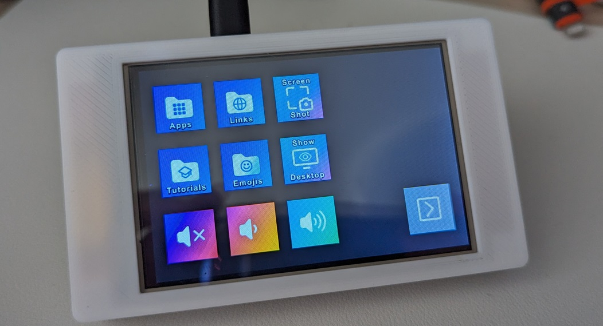
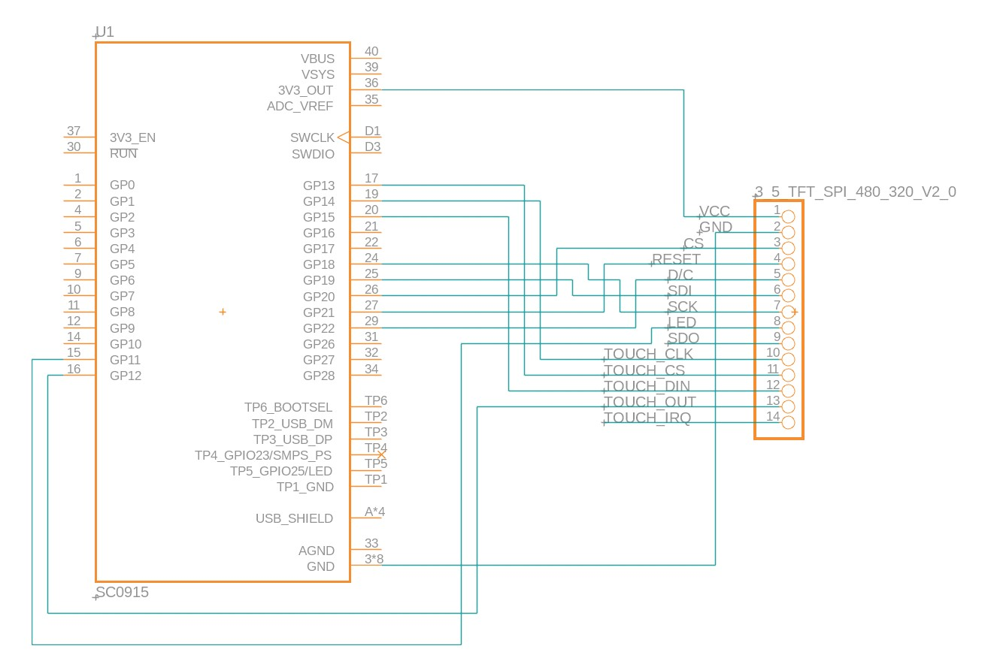
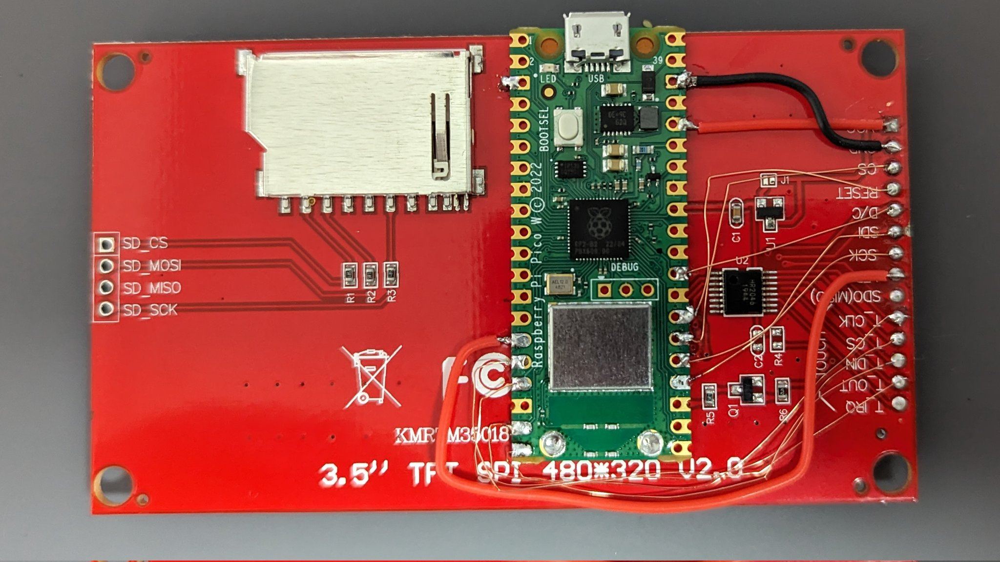

# Fakedeck
Using raspberry pi pico as a stream deck

## Avaiable devices - Can be modified from usb_descriptors.hpp
- Stream deck v2
- WIP: Stream deck Plus

## How to create
### Parts
- Raspberry Pi Pico
- ILI9488 TFT with Touch: [AliExpress](https://www.aliexpress.com/item/32985467436.html)
  > [!IMPORTANT]
  > Make sure to select "touch screen"
- Solder, wire, etc.
- 3D printers for creating a case - [Top](./assets/Case%20-%20Top.stl), [Bottom](./assets/Case%20-%20Bottom.stl)
- M3 x 16mm screw *4

### Wire

## TODO
- Make USB and LCD buffer
- Support touchscreen and dial report
- Add BOOTSEL & RUN bottom hole
