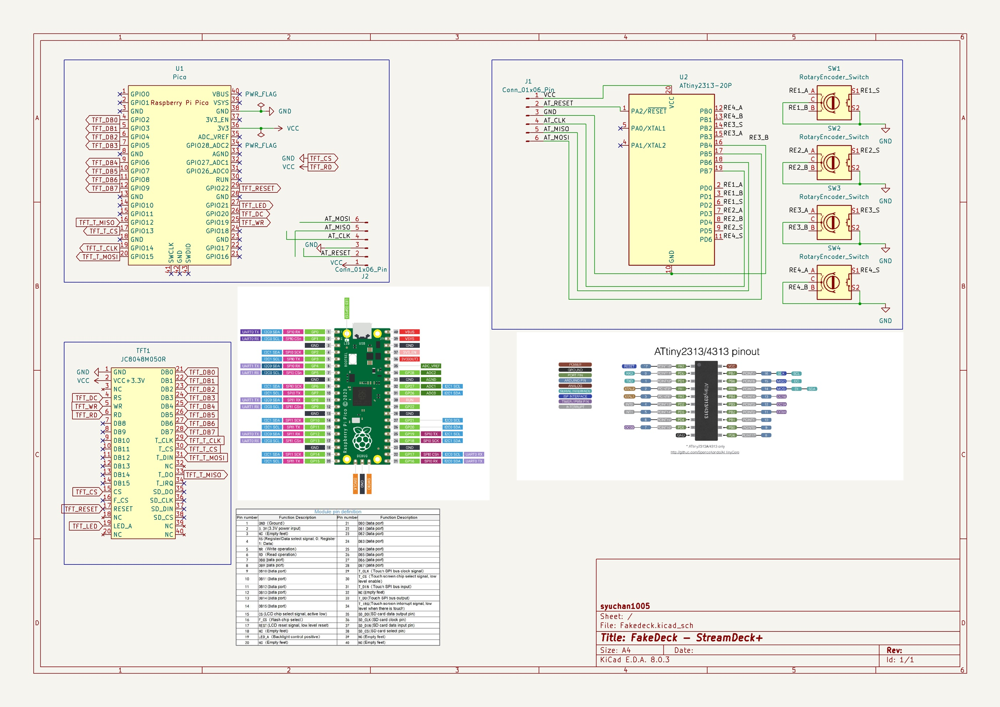

# Fakedeck
Using raspberry pi pico as a stream deck

## Avaiable devices - Can be modified from [src/deck_config.hpp](src/deck_config.hpp)
- Stream deck v2
- WIP: Stream deck Plus

## How to create : StreamDeck Mk.2
### Parts
- Raspberry Pi Pico
- ILI9488 TFT with Touch: [AliExpress](https://www.aliexpress.com/item/32985467436.html)
> [!IMPORTANT]
> Make sure to select "touch screen"
- Solder, wire, etc.
- 3D printers for creating a case - [Top](./assets/Case%20-%20Top.stl), [Bottom](./assets/Case%20-%20Bottom.stl)
- M3 x 6mm screw *4

### Wire

> [!NOTE]
> LCD uses 90 mA. 
> In the example, the back of the LCD is shaved and soldered to hold the pico in place.

### Build
1. Setup [PlatformIO IDE](https://platformio.org/platformio-ide)
2. Clone and open this project
3. Build .uf2 file!

## How to create : StreamDeck+ - WIP!

### Wire

### projects

#### pico_avrisp_wifi
Write to avr microcontroller (attiny2313) using Raspberry Pi Pico W via WiFi

This project access WiFi AP. You should copy `config.sample.ini` to `config.ini`, and change values to your Wifi settings.

> [!NOTE]
> In my enviroment, [avrdude](https://github.com/avrdudes/avrdude) can not communicate with Raspberry Pi Pico via usb serial. So, It write to avr microcontroller via WiFi.

> [!IMPORTANT]
> In my environment, avrdude 6.3(PlatformIO embedded version) can not write via WiFi. Please update to **^7.3**. (You can replace files in `tool-avrdude` package)

##### Reference
- [ESP8266AVRISP](https://github.com/esp8266/Arduino/tree/19b7a29720a6f2c95d06e2ea4baa335dcf32e68f/libraries/ESP8266AVRISP)

#### avr
Get the four rotary encoder with push switch values via SPI.

##### Reference
SPISlave.hpp
 - [avr-usi-spi](https://github.com/tessel/avr-usi-spi/blob/77ce496d6bc404684158e619695c2fb7bc76815a/spi_via_usi_driver.c)

### Tips
- [HID Explorer](https://nondebug.github.io/webhid-explorer/) is an easy HID testing tool using WebHID
- Reboot device and enter bootsel mode: Send `[02, FF]` to the output report
- Reboot device: Send `[02, FE]` to the output report

## TODO
- Support touchscreen and dial report - for Plus
- Support infobar and touch key - for Neo
